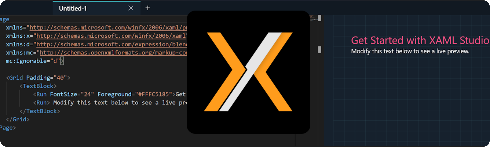
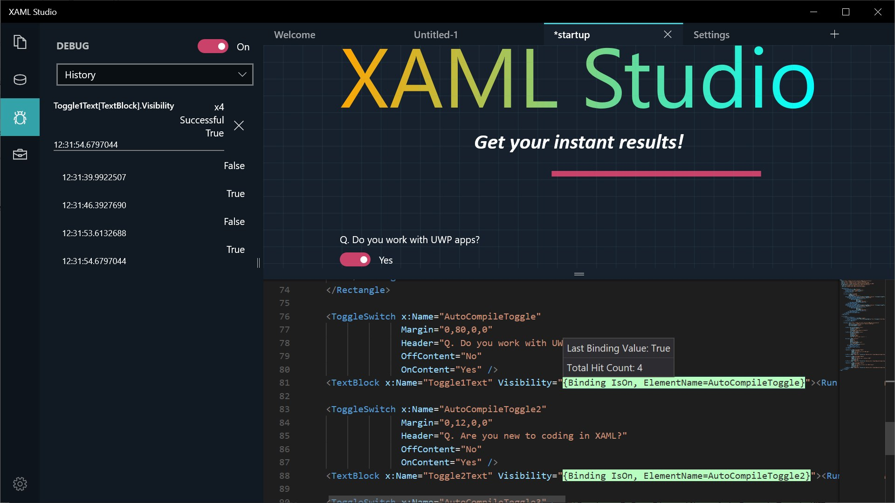

<h1 align="center">
    XAML Studio v1
</h1>

> [!IMPORTANT]  
> The `main` branch of XAML Studio is of the v1.1 Microsoft Store release. The most recent developments are in the `dev` branch. Outside of PRs to docs, any contributions should pertain to the `dev` branch.

Created for WinUI XAML developers, XAML Studio helps you rapidly prototype ideas before integrating them into your app within Visual Studio. It provides:

- **Live Edit and Interaction** ✏️
- **Binding Debugger** 🐞
- **Data Context Editor** 🗒️
- Auto-save and restore Documents 💾
- IntelliSense ✨
- Documentation Toolbox 📚
- Alignment Guides 📏
- Namespace Helpers 🌎 

<p align="center">

</p>
<p align="center">
<a href="http://aka.ms/GetXAMLStudio">
	
</a>
</p>

## 🚀 Getting started

Download [XAML Studio from the Microsoft Store](http://aka.ms/GetXAMLStudio) or follow these steps to install it manually:

### 1. Set up the environment

> [!IMPORTANT]
> XAML Studio requires [Visual Studio 2022](https://visualstudio.microsoft.com/vs/) or later for building and Windows 10 or newer to run.
If you're new to building apps with WinUI and the Windows App SDK, follow the [installation instructions](https://learn.microsoft.com/windows/apps/get-started/start-here).

**Required [Visual Studio components](https://learn.microsoft.com/windows/apps/get-started/start-here#22-required-workloads-and-components):**

- Windows application development
- Windows 17763 SDK

### 2. Clone the repository

```shell
git clone https://github.com/dotnet/XAMLStudio.git
```

### 3. Checkout the `dev` branch

```shell
git checkout dev
```

Current work is being done on the `dev` branch, not `main`.

### 3. Open XAMLStudio.slnx with Visual Studio!

Ensure that the `XAMLStudio` project is set as the startup project in Visual Studio.

Press <kbd>F5</kbd> to run AI Dev Gallery!

> [!NOTE]
> On ARM64-based PCs, make sure to build and run the solution as `ARM64` (and not as `x64`).

> [!NOTE]
> Having issues installing the app on your machine? Let us know by <a href="https://github.com/dotnet/XAMLStudio/issues">opening an issue</a> and we'll do our best to help!

## Contributing

This project has adopted the [Microsoft Open Source Code of Conduct](https://opensource.microsoft.com/codeofconduct/). For more information see the [Code of Conduct FAQ](https://opensource.microsoft.com/codeofconduct/faq/) or contact [opencode@microsoft.com](mailto:opencode@microsoft.com) with any additional questions or comments.

any additional questions or comments.

## 3rd Party OSS Usage

See File XamlStudio\Strings\thirdparty.json for third-party attributions (as displayed in app).

## LICENSE

MIT
